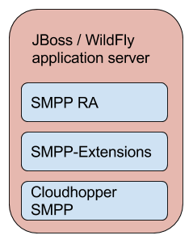

[[_design_smpp_extensions]]
= Architecture

[[_logical_divisions]]
== Logical Design

We usually use {this-platform} {this-application} as it is displayed in a picture below. We need to deploy Cloudhopper SMPP stack and SMPP-Extensions under a JBOSS or WildFly server and then an SMPP RA must be separately deployed.

	

For more details regarding installation, please refer to the {this-platform} {this-application} Installation Guide.

[[_dir_structure]]
== Directory Structure

The top-level directory is named {path} and immediately below this are sub-directories named _docs_, _oam_, _schell_, _jboss5_ and _wildfly_.
All the functional modules of the Stack reside in the _jboss5_ and _wildfly_ folders.

[subs="attributes"]
----

|- {this-folder}-smpp-extensions-{project-version}
		|- _docs
	
		|- oam
	
		|- shell

		|- jboss5
				|+ {this-folder}-smpp-server

		|- wildfly
				|+ commons
				|+ {this-folder}-smpp-server
				|+ template
----

The following is a description of the important services and libraries that make up {this-platform} {this-application} 

[path]_docs_::
  All relevant documentation for {this-platform} {this-application} . 

[path]_oam_::
  GUI WEB Management module 

[path]_shell_::
  This holds the Command Line Interface (CLI) module to manage the {this-platform} {this-application} .

[path]_jboss5_::
This folder contains the core protocol libraries that will be used by end applications as well as by the {this-application} deployed in JBoss AS.

[path]_wildfly_::
This folder contains the core protocol libraries that will be used by end applications as well as by the {this-application} deployed in WildFly AS.

== Functional Blocks

The major functional modules of the {this-application} are: 

. {this-application} _[dir: {this-folder}-jboss5 and {this-folder}-wildfly]_
. Shell _[dir: shell]_
. GUI _[dir: oam]_

The following sub-sections discuss in detail about the functionality of these individual components. 

[[_design_overview_shell]]
=== Shell - Comman Line Interface 

`Shell` is a Command Line Interface (CLI) tool that will allow you to manage different aspects of {this-platform}  {this-application}  in an interactive manner.
It connects to different instances of {this-platform}  {this-application}  which manages `SMPP server` settings and a list of `ESMEs` . Usually `Shell` will be invoked from a remote machine(remote to `Linksets` and application protocols).  

[[_design_overview_gui]]
=== Graphical User Interface

The Graphical User Interface will allow you to manage different aspects of {this-platform} {this-application} through a convenient user-friendly interface.
You can launch the GUI in any Web Browser and manage the Stack instance efficiently using the GUI operations.
 
