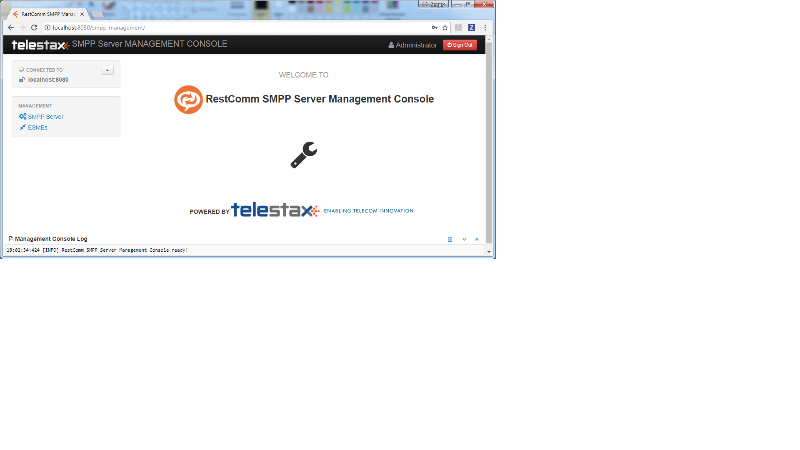

[[_running_smpp_extensions]]
= Running

You must ensure that you follow the steps outlined in the {this-platform} {this-application} Installation Guide to install the Components.
As explained in the Installation Guide, you may install  {this-application} as as a JBoss AS or a WildFly AS and install SMPP RA.
Once installed, you can run the different Components as described in the sections below.

[[_running_smpp_extensions_service]]
== Running {this-platform} {this-application}

.Procedure: Start {this-application} and SMPP RA
. Pre-requisite: You must have {this-application} deployed in the JBoss Application Server as explained in the Installation Guide.
. All you have to do to start the Service is start the JBoss AS.
  This will automatically start the {this-application} and SMPP RA.
  To start the JBoss Server you must execute the [path]_run.sh_ (Unix) or [path]_run.bat_ (Microsoft Windows) startup script in the [path]_<jboss_install_directory>/bin_ folder (on Unix or Windows).  
. Result: If the service started properly you should see following lines in the Unix terminal or Command Prompt depending on your environment: 
+
----
2018-01-04 17:42:54,731 INFO  [org.jboss.web.tomcat.service.deployers.TomcatDeployment] (main) deploy, ctxPath=/admin-console
2018-01-04 17:42:54,762 INFO  [javax.enterprise.resource.webcontainer.jsf.config] (main) Initializing Mojarra (1.2_12-b01-FCS) for context '/admin-console'
2018-01-04 17:42:55,711 INFO  [org.jboss.web.tomcat.service.deployers.TomcatDeployment] (main) deploy, ctxPath=/
2018-01-04 17:42:55,807 INFO  [org.jboss.web.tomcat.service.deployers.TomcatDeployment] (main) deploy, ctxPath=/jmx-console
2018-01-04 17:42:55,901 INFO  [org.jboss.web.tomcat.service.deployers.TomcatDeployment] (main) deploy, ctxPath=/jolokia
2018-01-04 17:42:55,931 INFO  [org.apache.catalina.core.ContainerBase.[jboss.web].[localhost].[/jolokia]] (main) jolokia-agent: No access restrictor found at classpath:/jolokia-access.xml, access to all MBeans is allowed
2018-01-04 17:42:56,778 INFO  [org.jboss.web.tomcat.service.deployers.TomcatDeployment] (main) deploy, ctxPath=/restcomm-slee-management
2018-01-04 17:42:59,273 INFO  [org.jboss.web.tomcat.service.deployers.TomcatDeployment] (main) deploy, ctxPath=/slee-management-console
2018-01-04 17:42:59,291 INFO  [org.mobicents.slee.container.management.console.server.ManagementConsole] (main) Mobicents Management Console initialized
2018-01-04 17:42:59,760 INFO  [org.jboss.web.tomcat.service.deployers.TomcatDeployment] (main) deploy, ctxPath=/smpp-management
2018-01-04 17:43:03,269 INFO  [org.mobicents.slee.container.management.jmx.DeploymentMBeanImpl] (main) Installing DeployableUnitID[url=file:/E:/JavaT/jboss_smpp/server/default/deploy/smpp-server-ra-du-7.0.0-SNAPSHOT.jar/]
2018-01-04 17:43:03,624 INFO  [org.mobicents.slee.container.management.jmx.DeploymentMBeanImpl] (main) Installed LibraryID[name=library-smpp-server,vendor=library-smpp-server,version=1.0]
2018-01-04 17:43:03,624 INFO  [org.mobicents.slee.container.management.jmx.DeploymentMBeanImpl] (main) Installed EventTypeID[name=org.restcomm.slee.resource.smpp.DATA_SM_RESP,vendor=org.restcomm,version=1.0]
2018-01-04 17:43:03,625 INFO  [org.mobicents.slee.container.management.jmx.DeploymentMBeanImpl] (main) Installed EventTypeID[name=org.restcomm.slee.resource.smpp.SUBMIT_MULTI_RESP,vendor=org.restcomm,version=1.0]
2018-01-04 17:43:03,625 INFO  [org.mobicents.slee.container.management.jmx.DeploymentMBeanImpl] (main) Installed EventTypeID[name=org.restcomm.slee.resource.smpp.DELIVER_SM,vendor=org.restcomm,version=1.0]
2018-01-04 17:43:03,625 INFO  [org.mobicents.slee.container.management.jmx.DeploymentMBeanImpl] (main) Installed EventTypeID[name=org.restcomm.slee.resource.smpp.SUBMIT_SM_RESP,vendor=org.restcomm,version=1.0]
2018-01-04 17:43:03,625 INFO  [org.mobicents.slee.container.management.jmx.DeploymentMBeanImpl] (main) Installed EventTypeID[name=org.restcomm.slee.resource.smpp.DELIVER_SM_RESP,vendor=org.restcomm,version=1.0]
2018-01-04 17:43:03,625 INFO  [org.mobicents.slee.container.management.jmx.DeploymentMBeanImpl] (main) Installed EventTypeID[name=org.restcomm.slee.resource.smpp.DATA_SM,vendor=org.restcomm,version=1.0]
2018-01-04 17:43:03,625 INFO  [org.mobicents.slee.container.management.jmx.DeploymentMBeanImpl] (main) Installed EventTypeID[name=org.restcomm.slee.resource.smpp.SUBMIT_MULTI,vendor=org.restcomm,version=1.0]
2018-01-04 17:43:03,626 INFO  [org.mobicents.slee.container.management.jmx.DeploymentMBeanImpl] (main) Installed EventTypeID[name=org.restcomm.slee.resource.smpp.SUBMIT_SM,vendor=org.restcomm,version=1.0]
2018-01-04 17:43:03,626 INFO  [org.mobicents.slee.container.management.jmx.DeploymentMBeanImpl] (main) Installed EventTypeID[name=org.restcomm.slee.resource.smpp.REQUEST_TIMEOUT,vendor=org.restcomm,version=1.0]
2018-01-04 17:43:03,626 INFO  [org.mobicents.slee.container.management.jmx.DeploymentMBeanImpl] (main) Installed EventTypeID[name=org.restcomm.slee.resource.smpp.SEND_PDU_STATUS,vendor=org.restcomm,version=1.0]
2018-01-04 17:43:03,626 INFO  [org.mobicents.slee.container.management.jmx.DeploymentMBeanImpl] (main) Installed EventTypeID[name=org.restcomm.slee.resource.smpp.RECOVERABLE_PDU_EXCEPTION,vendor=org.restcomm,version=1.0]
2018-01-04 17:43:03,635 INFO  [org.mobicents.slee.container.management.jmx.DeploymentMBeanImpl] (main) Installed ResourceAdaptorTypeID[name=SMPPServerResourceAdaptorType,vendor=org.restcomm,version=1.0]
2018-01-04 17:43:03,639 INFO  [org.mobicents.slee.container.management.jmx.DeploymentMBeanImpl] (main) Installed ResourceAdaptorID[name=SMPPServerResourceAdaptor,vendor=org.restcomm,version=1.0]
2018-01-04 17:43:03,639 INFO  [org.mobicents.slee.container.management.jmx.DeploymentMBeanImpl] (main) Installed DeployableUnitID[url=file:/E:/JavaT/jboss_smpp/server/default/deploy/smpp-server-ra-du-7.0.0-SNAPSHOT.jar/]
2018-01-04 17:43:03,935 INFO  [org.mobicents.slee.container.management.ResourceManagement] (main) Created Resource Adaptor Entity SmppServerRA for ResourceAdaptorID[name=SMPPServerResourceAdaptor,vendor=org.restcomm,version=1.0] Config Properties: []
2018-01-04 17:43:04,191 INFO  [org.restcomm.smpp.EsmeManagement] (main) Loading ESME configuration from E:\JavaT\jboss_smpp\server\default\data\SmppManagement_esme.xml
2018-01-04 17:43:04,247 INFO  [org.restcomm.smpp.SmppManagement] (main) Started SmppManagement
2018-01-04 17:43:04,280 INFO  [org.restcomm.smpp.SmppServerManagement] (main) Loading SMPP Server Properties from E:\JavaT\jboss_smpp\server\default\data\SmppManagement_smppserver.xml
2018-01-04 17:43:04,421 INFO  [org.restcomm.smpp.SmppServerManagement] (main) Starting SMPP server...
2018-01-04 17:43:04,437 INFO  [com.cloudhopper.smpp.impl.DefaultSmppServer] (main) SmppManagement started at 127.0.0.1:2776
2018-01-04 17:43:04,437 INFO  [org.restcomm.smpp.SmppServerManagement] (main) SMPP server started
2018-01-04 17:43:04,438 INFO  [org.restcomm.smpp.SmppServerOpsThread] (Thread-21) SmppServerOpsThread started.
2018-01-04 17:43:04,481 INFO  [org.restcomm.smpp.SmppClientOpsThread] (Thread-22) SmppClientOpsThread started.
2018-01-04 17:43:04,482 INFO  [javax.slee.RAEntityNotification[entity=SmppServerRA].SmppServerResourceAdaptor] (main) Activated RA Entity SmppServerRA
2018-01-04 17:43:04,483 INFO  [org.mobicents.slee.container.management.ResourceManagement] (main) Activated RA Entity SmppServerRA
2018-01-04 17:43:04,756 INFO  [org.mobicents.slee.container.management.ResourceManagement] (main) Bound link between RA Entity SmppServerRA and Name SmppServerRA
2018-01-04 17:43:05,019 INFO  [org.restcomm.smpp.oam.SmppShellExecutor] (main) Started SmppShellExecutor SmppManagement
2018-01-04 17:43:05,023 INFO  [org.restcomm.ss7.management.console.ShellServer] (main) Starting SS7 management shell environment
2018-01-04 17:43:05,027 INFO  [org.restcomm.ss7.management.console.ShellServer] (main) ShellExecutor listening at /127.0.0.1:3435
2018-01-04 17:43:05,058 INFO  [org.apache.coyote.http11.Http11Protocol] (main) Starting Coyote HTTP/1.1 on http-127.0.0.1-8080
2018-01-04 17:43:05,069 INFO  [org.apache.coyote.ajp.AjpProtocol] (main) Starting Coyote AJP/1.3 on ajp-127.0.0.1-8009
2018-01-04 17:43:05,075 INFO  [org.jboss.bootstrap.microcontainer.ServerImpl] (main) JBoss (Microcontainer) [5.1.0.GA (build: SVNTag=JBoss_5_1_0_GA date=200905221634)] Started in 45s:714ms
----		 
. If you are starting {this-application} for the first time, {this-application} is not configured.
  You need to use the Shell Client to connect to {this-application} .
  Using CLI you can configure how service interacts with SMPP network.
  You can also use the GUI to achieve the same.
  Once configured, the state and configuration of SMPP is persisted which stands server re-start.

.Procedure: Stop {this-application} Service and SMPP RA
. To stop the {this-application} service and SMPP RA, you must shut down the JBoss Application Server.
  To shut down the server(s) you must execute the `shutdown.sh -s` (Unix) or  `shutdown.bat -s` (Microsoft Windows) script in the [path]_<jboss_install_directory>/bin_  directory (on Unix or Windows).
. If the Service stopped properly, you will see the following three lines as the  last output in the Unix terminal or Command Prompt: 
+
----
[Server] Shutdown complete
Halting VM
----

[[_running_shell]]
== Running the Shell`Shell`

[[_shell_start]]
=== Start the Shell Client

Shell client can be started with following command from [path]_$JBOSS_HOME/bin_			: 

[source]
----
[$] ./ss7-cli.sh
----

Once console starts, it will print following like information:

----

version=6.2.8.493,name={this-platform} CLI,prefix={this-folder},vendor=TeleStax
{this-folder}>
----

The `ss7-cli`			script supports the following options 

----

Usage: SS7 [OPTIONS]
Valid Options
-v           Display version number and exit
-h           This help screen
----

[[_connect_shell]]
=== Connect to Managed Instance

Shell needs to connect to managed instance.
Command to connect has following structure:

[source]
----

connect <IP> <PORT>
----

.Connect to remote machine
====
----

mobicents>connect 10.65.208.215 3435

mobicents(10.65.208.215:3435)>
----
====

NOTE: Host IP and port are optional, if not specified, shell will try to connect to `127.0.0.1:3435`			

[[_disconnect_shell]]
=== Disconnect

Command to disconnect has following structure:

[source]
----
ss7 discconnect
----

.Disconnect
====
----

mobicents(10.65.208.215:3435)>ss7 disconnect

Bye
mobicents>
----
====

[[_cli_security]]
=== Authentication and Audit Logs

==== Security

Security is a fundamental requirement of any Telecom application.
You must control access to your SMPP network and restrict who is allowed to access what and perform what operations.
 

{this-platform} {this-application} CLI Security is based on the JBoss Security Framework.
The JBoss Security framework provides support for a role-based declarative security model as well as integration of custom security via a security proxy layer.
The default implementation of the declarative security model is based on Java Authentication and Authorization Service (JAAS) login modules and subjects.
 

.Procedure: Enable Security
. Add a new parameter named "`securityDomain`" to the "ShellExecutor" bean in the configuration file _jboss-5.1.0.GA/server/default/deploy/{this-folder}-ss7-service/META-INF/jboss-beans.xml_ and save the changes. 
+
----

<property name="securityDomain">java:/jaas/jmx-console</property>
----					
. Configure the security domain in the file _jboss-5.1.0.GA/server/default/conf/login-config.xml_ following the instructions in the JBoss Admin Guide. 
. Create entries for user id and password in the file [path]_ jboss-5.1.0.GA/server/default/conf/props/jmx-console-users.properties_ for every user allowed to access the CLI.	 

.Procedure: Disable Security
. Delete all configurations created as mentioned above and remove the parameter "`securityDomain`" from the "Shell Executor" bean defined in _jboss-5.1.0.GA/server/default/deploy/{this-folder}-ss7-service/META-INF/jboss-beans.xml_.			 

If you would like to read more about the JBoss Security Framework, please refer to the JBoss Admin Guide available in their website. 

[[_audit]]
==== Audit Configuration

If security is enabled then you can log the operations performed by every user.
 

.Procedure: Enable Audit
. Add a new appender to the file [path]_jboss-5.1.0.GA/server/default/conf/jboss-log4j.xml_ as below:  
+
----

<appender name="AUDIT" class="org.jboss.logging.appender.DailyRollingFileAppender">
	<errorHandler class="org.jboss.logging.util.OnlyOnceErrorHandler"/>
	<param name="File" value="${jboss.server.log.dir}/audit.log"/>
	<param name="Append" value="true"/>
	<param name="DatePattern" value="'.'yyyy-MM-dd"/>
	<layout class="org.apache.log4j.PatternLayout">
		<param name="ConversionPattern" value="%d %-5p [%c] (%t:%x) %m%n"/>
	</layout>
</appender>
----	 
. Add a new category to the file [path]_jboss-5.1.0.GA/server/default/conf/jboss-log4j.xml_ as below:  
+
----

<category name="org.jboss.security.audit.providers.LogAuditProvider" additivity="false">
	<priority value="TRACE"/>
	<appender-ref ref="AUDIT"/>
</category>
----	 			

When security and audit is enabled, a sample audit log looks like this: 
----

2012-11-28 22:17:27,005 TRACE [org.jboss.security.audit.providers.LogAuditProvider] (pool-19-thread-8:) [Success]message=login success;principal=admin;
2012-11-28 22:17:47,659 TRACE [org.jboss.security.audit.providers.LogAuditProvider] (pool-19-thread-1:) [Info]response=Successfully added client Association=SCTPAssoc1;principal=admin;command=sctp association create SCTPAssoc1 CLIENT 127.0.0.1 2775 127.0.0.1 2776;
2012-11-28 22:18:06,773 TRACE [org.jboss.security.audit.providers.LogAuditProvider] (pool-19-thread-3:) [Success]message=logout success;principal=admin;
----	 

[[_commands_help]]
=== Command-line Completion

{this-platform} {this-application} Shell supports Command-line completion (Tab Completion) allowing you to type the first (or first few) character(s) of the comand and press tab to fill in the rest of the command.
As soon as you enter the CLI (by executing the [path]_ss7-cli.sh_ script) you can make use of this feature to view all possible commands.
 

When you first enter CLI and press the "tab" key, CLI will display all operations permitted in that context.
Once you connect to a managed instance and while staying connected if you press the "tab" key it will display all other commands allowed. 

[source]
----

mobicents> [tab key press]
history  connect  exit
mobicents>connect 10.65.208.215 3435
mobicents(10.65.208.215:3435)> [tab key press]
smpp        history     disconnect
----

If you enter the first few characters of a command and press "tab", CLI will automatically fill in the rest of the command or display all possible commands if there is more than one command beginning with the characters entered by you. 

[source]
----

mobicents(10.65.208.215:3435)>smpp [tab key press]
esme        smppserver        --help
mobicents(10.65.208.215:3435)>sctp
----

In addition, help files are also available for every command using the --help option.
The help files provide details of the command including possible parameters and examples of usage if applicable.
 

[source]
----

mobicents(10.65.208.215:3435)>smpp smppserver set port --help
Name
        smpp smppserver set port

SYNOPSIS
        smpp smppserver set port <port>

DESCRIPTION
        This command is used to set the port that the SMPP Server is listening t
o for
        incoming bind request.

        If unspecified, the default port is 2776.

        You must restart the SMPP Server for the new value to take effect.

SEE ALSO
        smpp esme create

mobicents(10.65.208.215:3435)>
----

[[_using_gui]]
== Running the Graphical User Interface

Open a Web Browser and navigate to http://localhost:8080/smpp-management/. The window will look similar to the figure below.
The GUI is divided into three sections:  

* A left panel listing the management units (SMPP server and ESMEs). You can click on any of these to select and navigate to the specific management unit.
* A main panel displaying the currently selected management unit.
  At the top of this panel you will find a bread crumb trail providing links back to each previous page that you navigated through in order to get to the current page.
  The main view is categorized into multiple tabs to manage different aspects of the selected layer.
* A bottom panel displaying the log data.
  You can clear the log anytime by clicking on the trash icon at the top right corner of this panel.
  You can also minimize or maximize this panel to suit your needs.

.GUI - Services
		

[[_connect_gui]]
=== Connect to a new Instance

You can connect to a new instance by entering the IP:Port values and the login credentials in the top left corner of the GUI.
However please note that this feature is not available in this release but will be fully functional in the next release.
 

[[_gui_security]]
=== Authentication

{this-platform} {this-application} GUI Management Security is based on the JBoss Security Framework.
This is explained in <<_security>>. 

